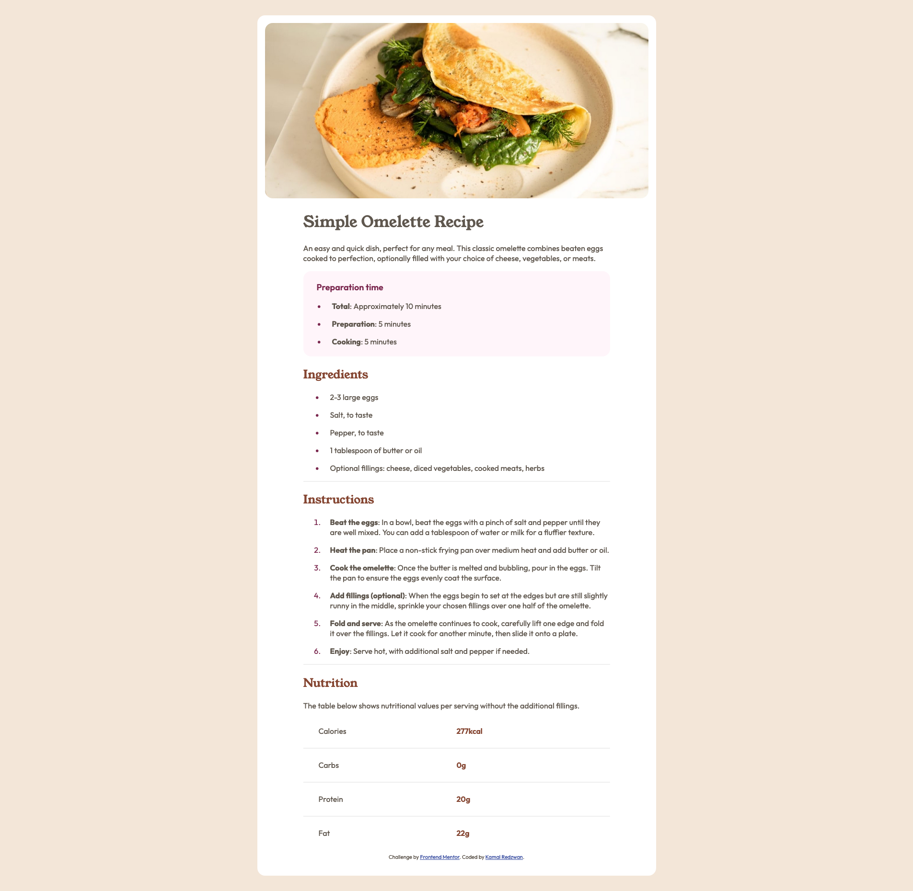

# Frontend Mentor - Recipe page solution

This is a solution to the [Recipe page challenge on Frontend Mentor](https://www.frontendmentor.io/challenges/recipe-page-KiTsR8QQKm). Frontend Mentor challenges help you improve your coding skills by building realistic projects.

## Table of contents

- [Overview](#overview)
  - [The challenge](#the-challenge)
  - [Screenshot](#screenshot)
  - [Links](#links)
- [My process](#my-process)
  - [Built with](#built-with)
  - [What I learned](#what-i-learned)
  - [Continued development](#continued-development)
  - [Useful resources](#useful-resources)
- [Author](#author)
- [Acknowledgments](#acknowledgments)

## Overview

### Screenshot

### Links

- Solution URL: [Frontend Mentor Solution](https://www.frontendmentor.io/solutions/using-plain-html-and-css-for-this-challenge-ElH3ThfkVY)
- Live Site URL: [Github Pages](https://kamal-redzwan.github.io/01-frontendmentor-recipe-page/)

## My process

### Built with

- Semantic HTML5 markup
- CSS custom properties
- Flexbox
- Mobile-first workflow

### What I learned

Some things that I've learn for this project is:-

- My first mistake was not adding 
 tags on <li> and found a but that didn't align the paragraphs.
- Changing the background from white on small breakpoints to colored background on bigger breakpoint.
- Adding the container padding for the larger breakpoint.
- Making the text align for the 'Nutritional' section. Setting width to a percentage fixed it.

### Continued development

- Will look on how to make the bullet points smaller.
- Change the numbered list font to bold.

### Useful resources

- [var() on MDN](https://developer.mozilla.org/en-US/docs/Web/CSS/var) - Guide on how to use CSS variables for easy referencing of colors.
- [How to change a bullet color on list](https://www.w3schools.com/howto/howto_css_bullet_color.asp) - This helped me for changing the bullet color.

## Author

- Website - [Kamal Redzwan](https://www.kamalredzwan.com)
- Frontend Mentor - [@kmlrdzwn](https://www.frontendmentor.io/profile/kmlrdzwn)
- Twitter - [@kamalredzwan](https://www.twitter.com/kamalredzwan)

## Acknowledgments

None for the moment. Will check on other's solution and learn from there as well.
