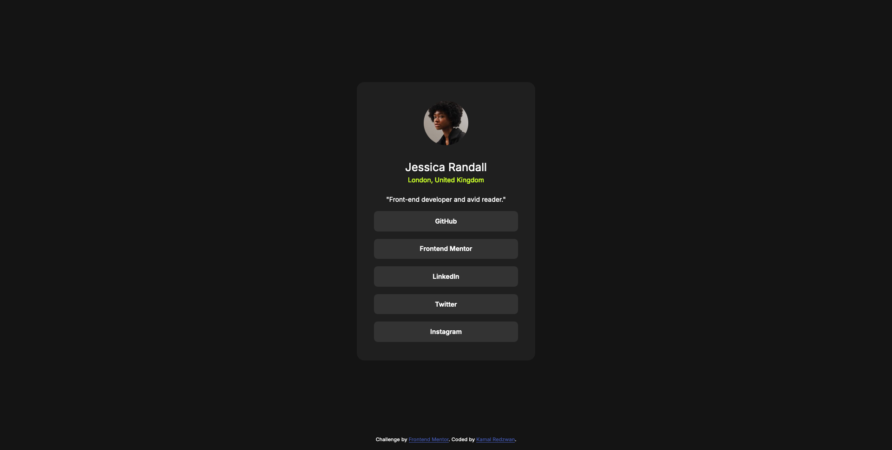

# Frontend Mentor - Social links profile solution

This is a solution to the [Social links profile challenge on Frontend Mentor](https://www.frontendmentor.io/challenges/social-links-profile-UG32l9m6dQ). Frontend Mentor challenges help you improve your coding skills by building realistic projects.

## Table of contents

- [Overview](#overview)
  - [The challenge](#the-challenge)
  - [Screenshot](#screenshot)
  - [Links](#links)
- [My process](#my-process)
  - [Built with](#built-with)
  - [What I learned](#what-i-learned)
- [Author](#author)

## Overview

### The challenge

Users should be able to:

- See hover and focus states for all interactive elements on the page

### Screenshot

### Links

- Solution URL: [Add solution URL here](https://your-solution-url.com)
- Live Site URL: [GitHub Pages](https://kamal-redzwan.github.io/02-frontendmentor-social-links-profile/)

## My process

### Built with

- Semantic HTML5 markup
- CSS custom properties
- Flexbox
- Mobile-first workflow

### What I learned

- Setting height on body to make it centered on the horizontal axis
- Remove focus ring with `outline: none;`

## Author

- Website - [Kamal Redzwan](https://www.kamalredzwan.com)
- Frontend Mentor - [@kamalredzwan](https://www.frontendmentor.io/profile/kmlrdzwn)
- Twitter - [@kamalredzwan](https://www.twitter.com/kamalredzwan)

**Note: Delete this note and add/remove/edit lines above based on what links you'd like to share.**
