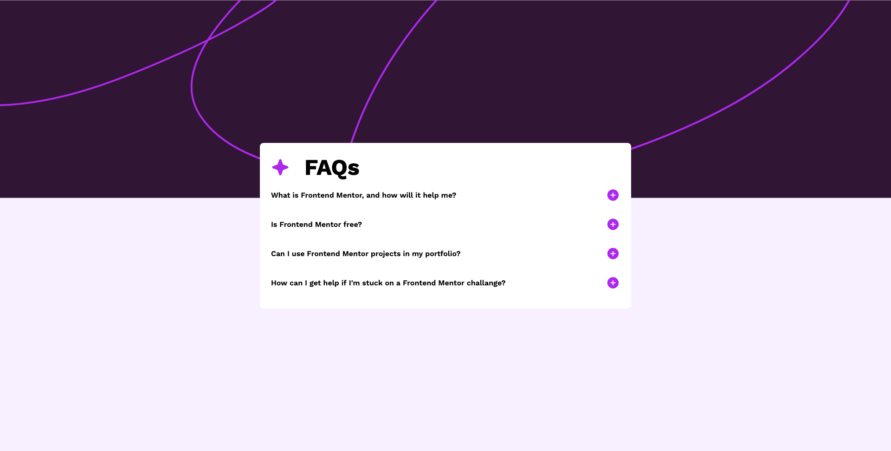

# Frontend Mentor - FAQ accordion solution

This is a solution to the [FAQ accordion challenge on Frontend Mentor](https://www.frontendmentor.io/challenges/faq-accordion-wyfFdeBwBz). Frontend Mentor challenges help you improve your coding skills by building realistic projects.

## Table of contents

- [Overview](#overview)
  - [The challenge](#the-challenge)
  - [Screenshot](#screenshot)
  - [Links](#links)
- [My process](#my-process)
  - [Built with](#built-with)
  - [What I learned](#what-i-learned)
  - [Continued development](#continued-development)
  - [Useful resources](#useful-resources)
- [Author](#author)

**Note: Delete this note and update the table of contents based on what sections you keep.**

## Overview

### The challenge

Users should be able to:

- Hide/Show the answer to a question when the question is clicked
- Navigate the questions and hide/show answers using keyboard navigation alone
- View the optimal layout for the interface depending on their device's screen size
- See hover and focus states for all interactive elements on the page

### Screenshot

### Links

- Solution URL: [Github Repo](https://github.com/kamal-redzwan/04-frontendmentor-faq-accordion)
- Live Site URL: [Github Pages](https://kamal-redzwan.github.io/04-frontendmentor-faq-accordion/)

## My process

### Built with

- Semantic HTML5 markup
- CSS custom properties
- Flexbox
- CSS Grid
- Mobile-first workflow

### What I learned

Learned to change the apply the height of the answer container from 0 to the content height using JS scrollHeight property and change back to null when click.
Also learn to select the next element sibling using JS.

### Continued development

I don't know how to navigate the questions and hide/show answers using keyboard navigation. Need advice on this / further research.

### Useful resources

- [W3Schools Accordion Solution](https://www.w3schools.com/howto/howto_js_accordion.asp) - This helps me on how to select the next element sibling using JS.
- [Freecodecamp Accordion Solution](https://www.freecodecamp.org/news/build-an-accordion-menu-using-html-css-and-javascript/) - This article helps me to set the answer height to 0.
- [Stackoverflow] (https://stackoverflow.com/questions/38903331/how-to-get-inner-html-content-height) - This helps me on how to get the content height using JS.

## Author

- Website - [Add your name here](https://www.kamalredzwan.com)
- Frontend Mentor - [@kmlrdzwn](https://www.frontendmentor.io/profile/kmlrdzwn)
- Twitter - [@kamalredzwan](https://www.twitter.com/kamalredzwan)
