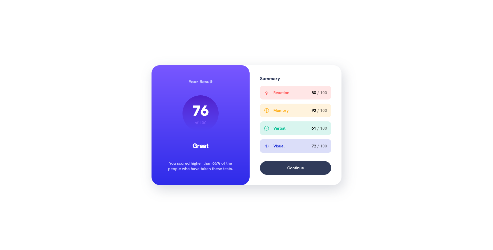

# Frontend Mentor - Results summary component solution

This is a solution to the [Results summary component challenge on Frontend Mentor](https://www.frontendmentor.io/challenges/results-summary-component-CE_K6s0maV). Frontend Mentor challenges help you improve your coding skills by building realistic projects.

## Table of contents

- [Overview](#overview)
  - [The challenge](#the-challenge)
  - [Screenshot](#screenshot)
  - [Links](#links)
- [My process](#my-process)
  - [Built with](#built-with)
  - [What I learned](#what-i-learned)
  - [Continued development](#continued-development)
  - [Useful resources](#useful-resources)
- [Author](#author)
- [Acknowledgments](#acknowledgments)

## Overview

### The challenge

Users should be able to:

- View the optimal layout for the interface depending on their device's screen size
- See hover and focus states for all interactive elements on the page
- **Bonus**: Use the local JSON data to dynamically populate the content

### Screenshot

### Links

- Solution URL: [Frontend Mentor Solution Page](https://www.frontendmentor.io/solutions/results-summary-component-with-vanilla-html-and-css-8hK6D1ZkMj)
- Live Site URL: [GitHub Pages](https://kamal-redzwan.github.io/05-frontendmentor-results-summary-component/)

## My process

### Built with

- Semantic HTML5 markup
- CSS custom properties
- Flexbox
- CSS Grid
- Mobile-first workflow

### What I learned

- Getting used to centering trick using 2 line of CSS display: grid; place-content: center;
- Learned how grid structure works in more detail by applying to this challenge
- Utility classes for changing the text color and background color of the result component
- Add CSS var that are repeated more in the code for easy access and changing them in the future

### Continued development

- Using data.json to dynamically populate the content. (Will work on this later)

### Useful resources

- [Josh Comeau Grid Tutorial](https://www.joshwcomeau.com/css/interactive-guide-to-grid/) - This helped me for freshen up CSS Grid concepts

## Author

- Website - [Kamal Redzwan](https://www.kamalredzwan.com)
- Frontend Mentor - [@kmlrdwn](https://www.frontendmentor.io/profile/kmlrdwn)
- Twitter - [@kamalredzwan](https://www.twitter.com/kamalredzwan)

## Acknowledgments

No one yet..
