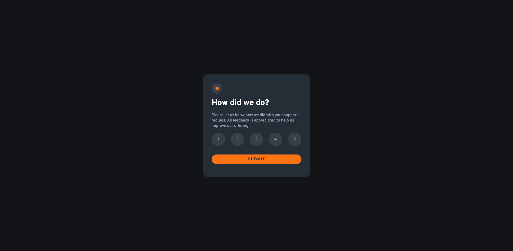

# Frontend Mentor - Interactive rating component solution

This is a solution to the [Interactive rating component challenge on Frontend Mentor](https://www.frontendmentor.io/challenges/interactive-rating-component-koxpeBUmI). Frontend Mentor challenges help you improve your coding skills by building realistic projects. 

## Table of contents

- [Overview](#overview)
  - [The challenge](#the-challenge)
  - [Screenshot](#screenshot)
  - [Links](#links)
- [My process](#my-process)
  - [Built with](#built-with)
  - [What I learned](#what-i-learned)
  - [Continued development](#continued-development)
  - [Useful resources](#useful-resources)
- [Author](#author)

**Note: Delete this note and update the table of contents based on what sections you keep.**

## Overview

### The challenge

Users should be able to:

- View the optimal layout for the app depending on their device's screen size
- See hover states for all interactive elements on the page
- Select and submit a number rating
- See the "Thank you" card state after submitting a rating

### Screenshot

Add a screenshot of your solution. The easiest way to do this is to use Firefox to view your project, right-click the page and select "Take a Screenshot". You can choose either a full-height screenshot or a cropped one based on how long the page is. If it's very long, it might be best to crop it.

Alternatively, you can use a tool like [FireShot](https://getfireshot.com/) to take the screenshot. FireShot has a free option, so you don't need to purchase it. 

Then crop/optimize/edit your image however you like, add it to your project, and update the file path in the image above.

**Note: Delete this note and the paragraphs above when you add your screenshot. If you prefer not to add a screenshot, feel free to remove this entire section.**

### Links

- Solution URL: [Frontendmentor Solution](https://www.frontendmentor.io/solutions/interactive-rating-component-challange-with-vanilla-html-css-and-js-_fiNOTn0_t)
- Live Site URL: [Github Pages](https://kamal-redzwan.github.io/08-frontendmentor-interactive-rating-component/)

## My process

### Built with

- Semantic HTML5 markup
- CSS custom properties
- Flexbox
- CSS Grid
- Mobile-first workflow

### What I learned

Got to practice Javacript for this project. Happy with the logic on disabling the button when no rating is selected.

### Continued development

Will refine the spacing later on.

### Useful resources

- [MDN JS Template Literal](https://developer.mozilla.org/en-US/docs/Web/JavaScript/Reference/Template_literals)
- [MDN JS textcontent](https://developer.mozilla.org/en-US/docs/Web/API/Node/textContent)
- [Stackoverflow Disabling Button](https://stackoverflow.com/questions/13831601/disabling-and-enabling-a-html-input-button)

## Author

- Website - [Kamal Redzwan](https://www.kamalredzwan.com)
- Frontend Mentor - [@kamalredzwan](https://www.frontendmentor.io/profile/kamalredzwan)
- Twitter - [@kamalredzwan](https://www.twitter.com/kamalredzwan)
