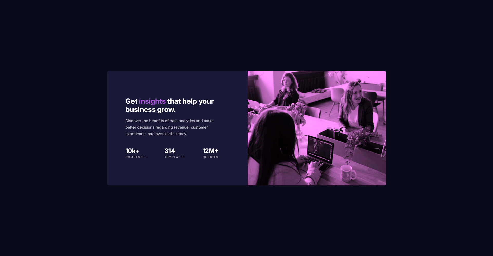

# Frontend Mentor - Stats preview card component solution

This is a solution to the [Stats preview card component challenge on Frontend Mentor](https://www.frontendmentor.io/challenges/stats-preview-card-component-8JqbgoU62). Frontend Mentor challenges help you improve your coding skills by building realistic projects. 

## Table of contents

- [Overview](#overview)
  - [The challenge](#the-challenge)
  - [Screenshot](#screenshot)
  - [Links](#links)
- [My process](#my-process)
  - [Built with](#built-with)
  - [What I learned](#what-i-learned)
  - [Useful resources](#useful-resources)
- [Author](#author)
- [Acknowledgments](#acknowledgments)

**Note: Delete this note and update the table of contents based on what sections you keep.**

## Overview

### The challenge

Users should be able to:

- View the optimal layout depending on their device's screen size

### Screenshot

### Links

- Solution URL: [Frontendmentor Solution](https://www.frontendmentor.io/solutions/stats-preview-card-component-challange-with-vanilla-html-and-css-rXiOd2jUmm)
- Live Site URL: [Github Pages](https://kamal-redzwan.github.io/11-frontendmaster-stats-preview-card-component/)

## My process

### Built with

- Semantic HTML5 markup
- CSS custom properties
- Flexbox
- CSS Grid
- Mobile-first workflow

### What I learned

- Using filter to overlay purple on the header image
- Add additional common devices breakpoint

### Useful resources

- [Purple Filter CSS](https://www.grepper.com/answers/419811/purple+filter+css) - This helps me to try the filter property to make the image purple, then I adjust accordingly to make it looks the same as the provided design.
- [TailwindCSS Responsive Design Docs](https://tailwindcss.com/docs/responsive-design) - This documentation helps me to add common devices breakpoints. Then I adjust accordingly with what best suits my eye.

## Author

- Website - [Kamal Redzwan](https://www.kamalredzwan.com)
- Frontend Mentor - [@kmlrdzwn](https://www.frontendmentor.io/profile/kmlrdzwn)
- Twitter - [@kamalredzwan](https://www.twitter.com/kamalredzwan)

## Acknowledgments

Google is your friend as always.
