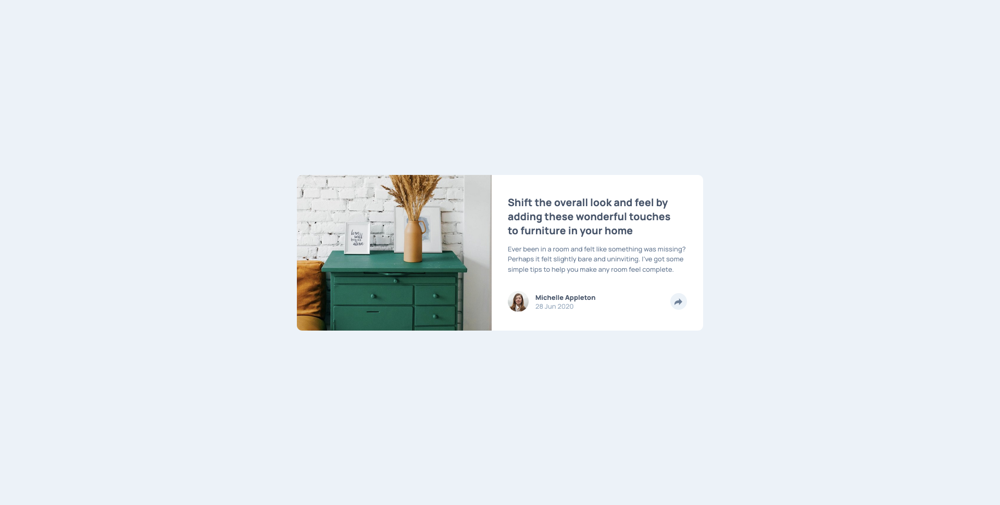

# Frontend Mentor - Article preview component solution

This is a solution to the [Article preview component challenge on Frontend Mentor](https://www.frontendmentor.io/challenges/article-preview-component-dYBN_pYFT). Frontend Mentor challenges help you improve your coding skills by building realistic projects. 

## Table of contents

- [Overview](#overview)
  - [The challenge](#the-challenge)
  - [Screenshot](#screenshot)
  - [Links](#links)
- [My process](#my-process)
  - [Built with](#built-with)
  - [What I learned](#what-i-learned)
  - [Useful resources](#useful-resources)
- [Author](#author)

## Overview

### The challenge

Users should be able to:

- View the optimal layout for the component depending on their device's screen size
- See the social media share links when they click the share icon

### Screenshot

### Links

- Solution URL: [Frontendmentor Solution Page](https://www.frontendmentor.io/solutions/article-preview-component-using-vanilla-html-and-css-rHvu79AyiK)
- Live Site URL: [Github Pages](https://kamal-redzwan.github.io/15-frontendmentor-article-preview-component/)

## My process

### Built with

- Semantic HTML5 markup
- CSS custom properties
- Flexbox
- CSS Grid
- Mobile-first workflow

### What I learned

- Setting z-index on the share socials component
- By removing the overflow: hidden on the main card and adding border radius to the image will make the share social component shows
- Learn how to apply transform on the share socials component

### Useful resources

- [CSS Transform MDN ](https://developer.mozilla.org/en-US/docs/Web/CSS/transform)
- [BEM Naming Convention](https://getbem.com/naming/)

## Author

- Website - [Kamal Redzwan](https://www.kamalredzwan.com)
- Frontend Mentor - [@kmlrdzwn](https://www.frontendmentor.io/profile/kmlrdzwn)
- Twitter - [@kamalredzwan](https://www.twitter.com/kamalredzwan)